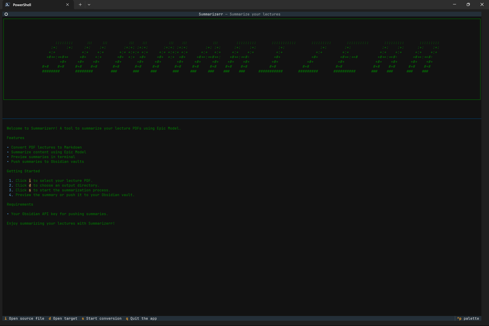
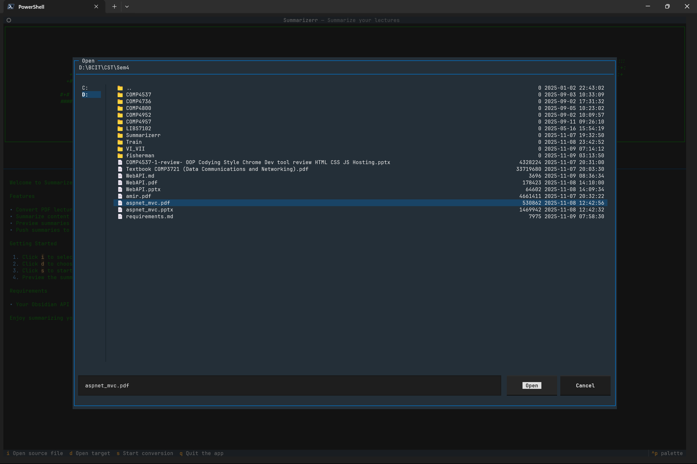
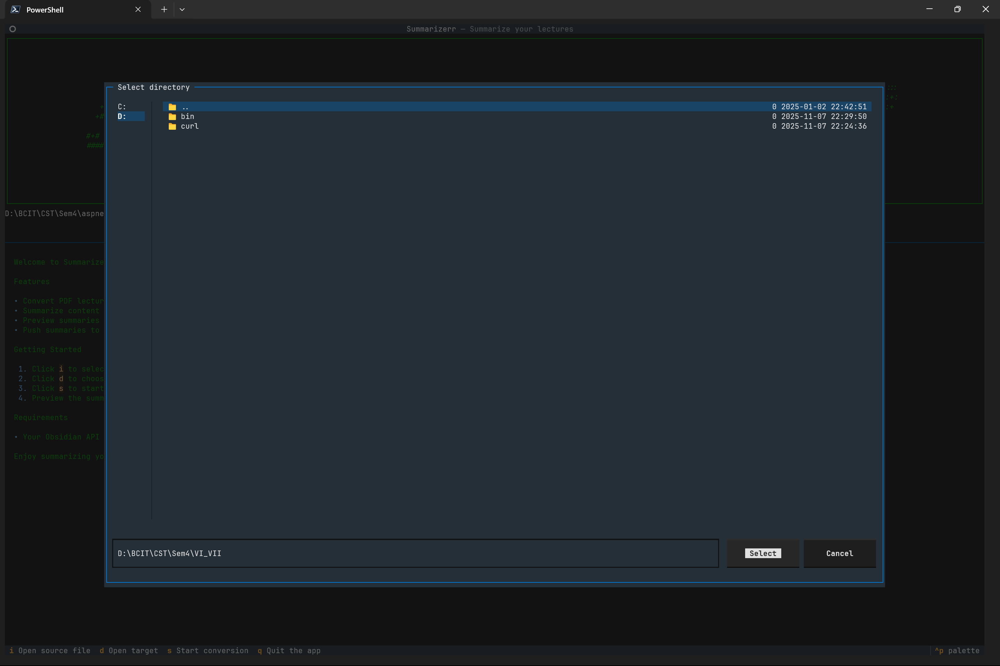
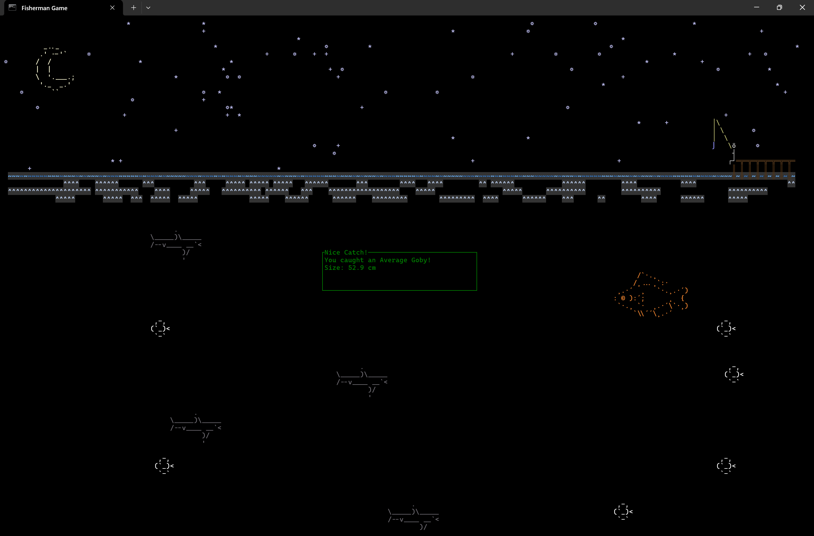
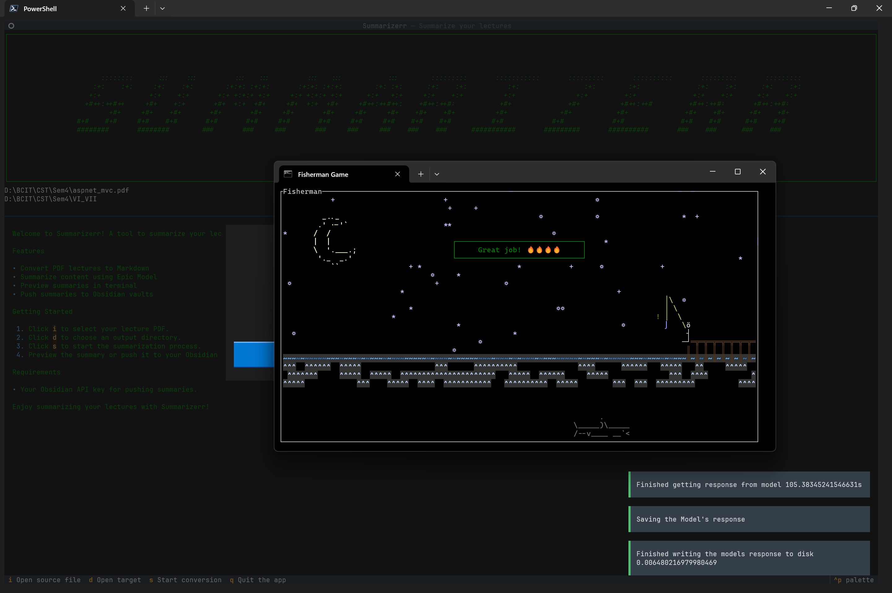
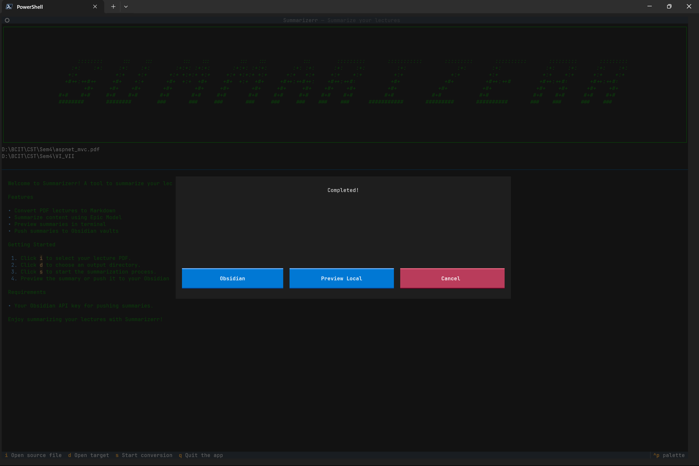
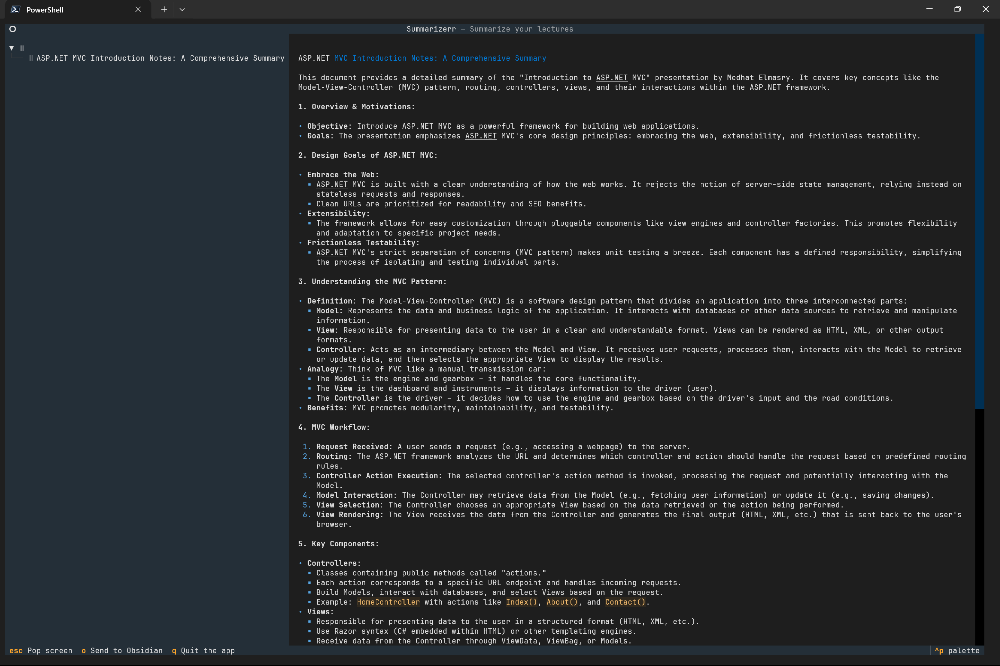
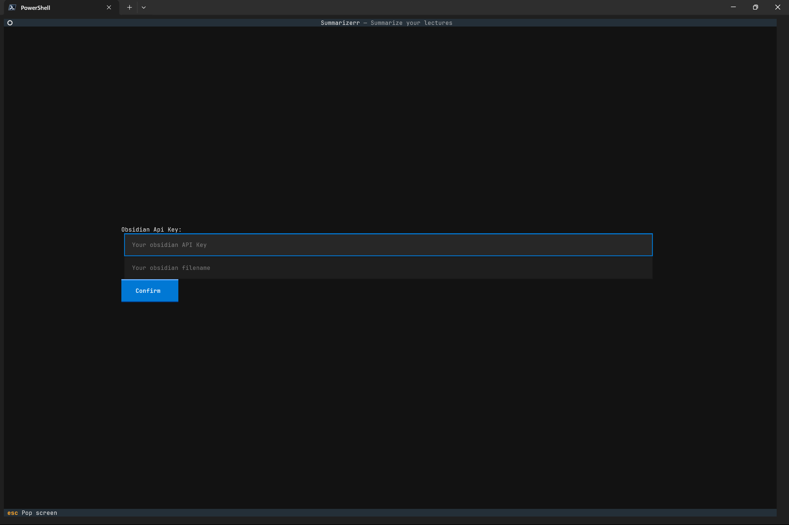

# Introduction (Our Story)


This could be you, but converting your instructions slides into markdown files (via ai).

Yo chat this app cooks🧑‍🍳 up a pdf file and churns it out into some buttery🧈 markdown. You gots the option to peep🐤 it as is once converted or pop🥤 that croissant🥐 into your obsidian app!

Inconvenient slides? Use our app to vaporize and turn them into markdown that you can read (but probably wont). The tool even Obsidianifies these documents for you.

Your welcome!

Additionally you can play a cool fishing game while the model cooks

Your welcome!

## Product Images

Main menu


File picker


Directory picker


Processing screen


Processing fishing game


Processing done



Markdown preview


Send to obsidian



## Team

- Bryson Lindy
- Phyo Kha
- Richard Ho
- Will Otterbien

✨ Consultants ✨
- Ben Henry

# Technology

| Languages | Frameworks | Infrastructure |
| :- | :- | :- |
| python | textual | digital ocean |
| rust | | |

# Run the Application

1. Clone the repository

2. In the root create python venv

```pwsh
python -m venv .venv
```

3. Turn on venv
```pwsh
./.venv/Scripts/Activate
```

4. Install requirements
```pwsh
pip install -r requirements.txt
```

5. Profit

6. Run the program with python3
```pwsh
python main.py
```

7. Run main with arguments
```pwsh
pythom main.py --file "/my/epic/file/path" --odir "/my/epic/directory/path"
```

**done**

# Application Instructions

## Requirements 
- You will need your lecture notes. 
- You will need Obsidian API. Also Obsidian (you don't need to connect to Obsidian).

## Getting Started 

**Main screen**
- Click `i` to input the file that you want to summarize. 
- Click `d` for output directory, this is where the summarized notes will be stored.
- Click `s` to start the summarization process.

**Running screen**
- Click `q` quit app
- Click `esc` to go back to the previous page
- After summarization, you can open the summarized notes in Obsidian by clickin`Obsidian` button.
- You can also view the summarized notes in the app by clicking the `Preview Local` button.